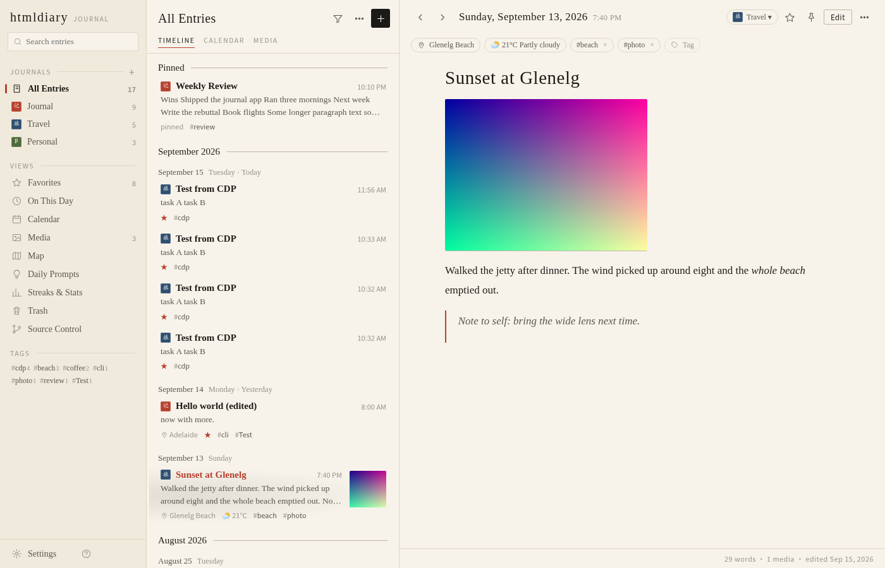
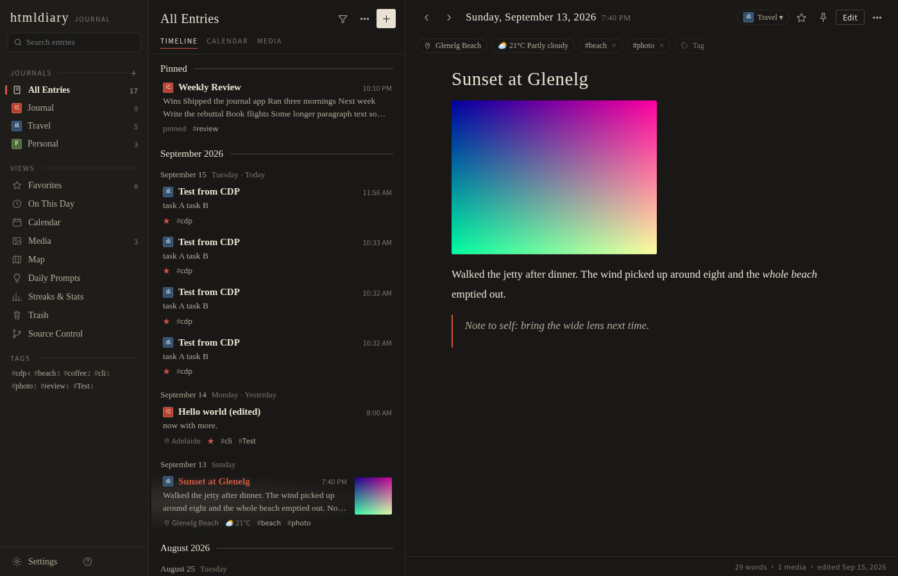
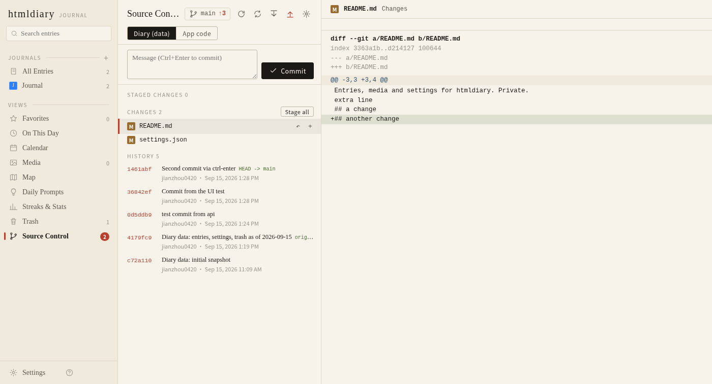
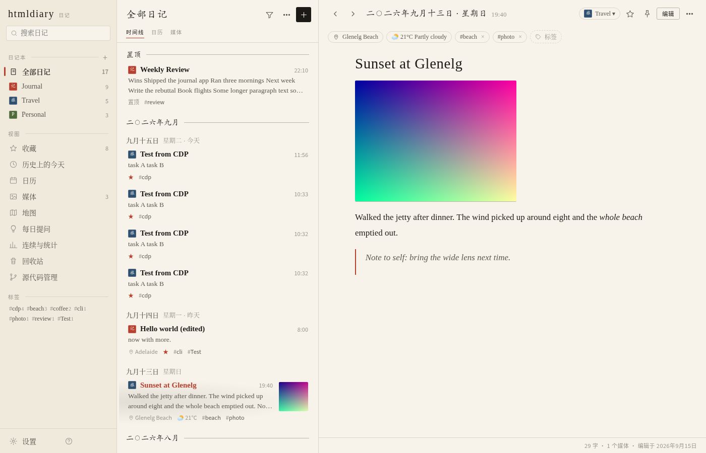
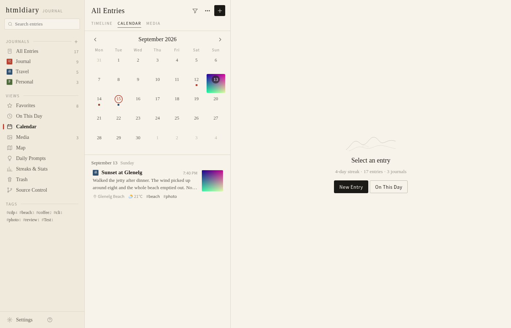
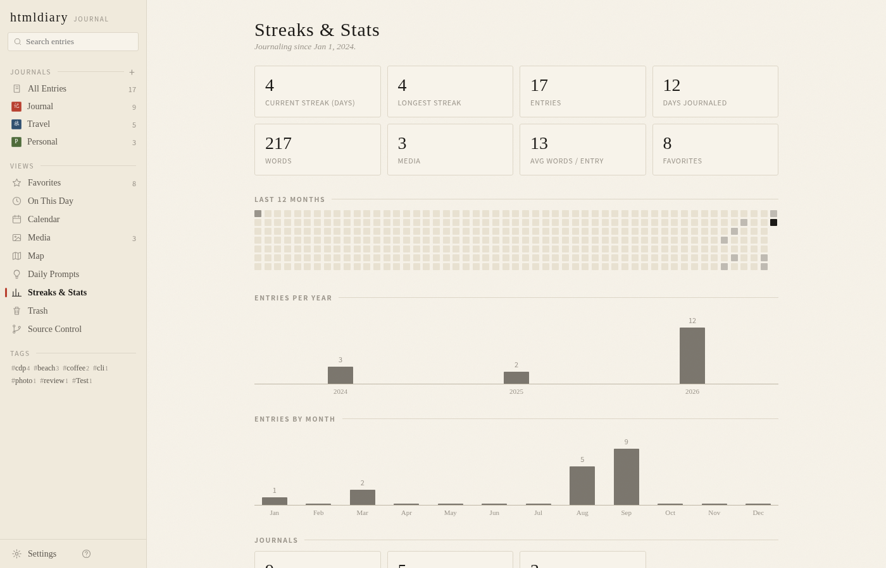
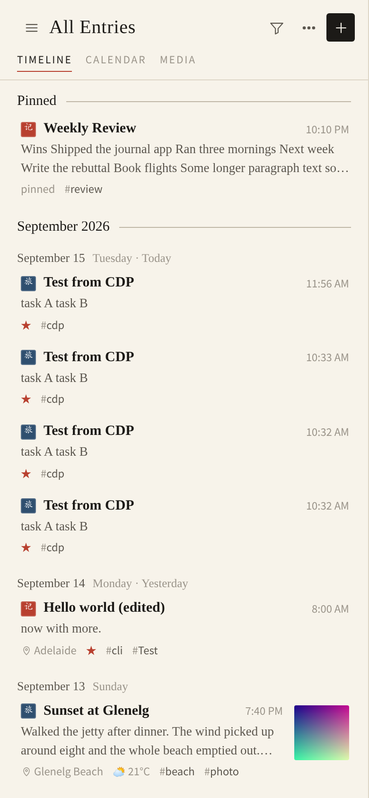
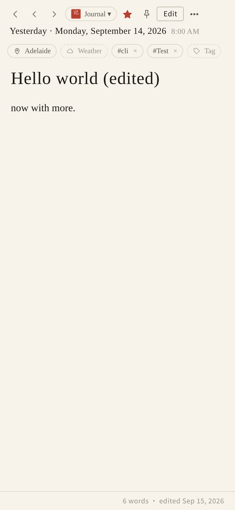

# htmldiary

A private, file-first journal as a plain website you run on your own machine, with an ink-wash look:
paper, ink, and one stroke of cinnabar. Sister project of [htmlkb](https://github.com/jianzhou0420/htmlkb):
same zero-dependency bet, applied to a diary.
Zero dependencies: Python 3.8+ standard library on the server, vanilla JS in the browser
(bundled: [marked](https://github.com/markedjs/marked) for Markdown, [Leaflet](https://leafletjs.com) for the map).

```bash
./run.sh            # http://127.0.0.1:8120/
./run.sh 9000       # another port
HOST=0.0.0.0 ./run.sh   # reachable on the LAN (no auth — use the passcode + a firewall)
HTMLDIARY_DATA=~/journal ./run.sh   # keep the data folder elsewhere
```

## Looks like

<table>
  <tr>
    <td width="50%" align="center"><strong>Timeline · paper</strong></td>
    <td width="50%" align="center"><strong>Timeline · night ink</strong></td>
  </tr>
  <tr>
    <td></td>
    <td></td>
  </tr>
  <tr>
    <td align="center"><strong>Source control (VS Code-style)</strong></td>
    <td align="center"><strong>简体中文 · Chinese numerals</strong></td>
  </tr>
  <tr>
    <td></td>
    <td></td>
  </tr>
  <tr>
    <td align="center"><strong>Calendar</strong></td>
    <td align="center"><strong>Streaks &amp; stats</strong></td>
  </tr>
  <tr>
    <td></td>
    <td></td>
  </tr>
</table>

<p align="center">
  
  &nbsp;&nbsp;
  
  <br><em>Phone layout — drawer sidebar, full-screen entry</em>
</p>

## What it does

| Feature | htmldiary |
|---|---|
| Multiple journals | Sidebar journals, each with a colour and a one- or two-character seal that marks its entries; default journal; move entries between journals |
| Timeline | Month running heads and a date line per day, title / excerpt / thumbnail / meta line, pinned entries on top; dates in English or Chinese numerals |
| Calendar view | Month grid with journal dots or photo thumbnails, click a day to see or write entries |
| Media view | Grid of every photo / video grouped by month |
| Map view | Leaflet + OpenStreetMap, one marker per geotagged entry |
| On This Day | Entries from the same date in past years |
| Favorites, pins, tags | Star, pin, tags with autocomplete, tag filter in the sidebar |
| Location + weather | Place search / current location (OpenStreetMap Nominatim), weather for the entry's time (Open-Meteo, incl. past dates) |
| Photos, videos, audio | Toolbar button, drag & drop, paste from clipboard; lightbox |
| Rich text | Markdown editor with formatting bar (bold, italic, heading, lists, checklists, quote, code, divider), list continuation, live checklists in read mode |
| Templates | Built-in templates (Daily Reflection, Gratitude, Weekly Review, …), editable in Settings |
| Daily prompts | Rotating prompt of the day, "Answer" creates an entry |
| Streaks & stats | Current / longest streak, words, heatmap of the last 12 months, per-year and per-month bars |
| Search | Full text + `#tag` terms, filters for favorites / media / year, sort order |
| Trash | Soft delete with restore / delete forever / empty |
| Passcode lock | Passcode (hashed) on load + auto-lock after idle time |
| Reminders | Daily "time to write" browser notification while a tab is open |
| Appearance | Paper (light) / night ink (dark) / system; serif, sans or mono entry font; font size |
| Languages | 16 interface languages (English, 简体中文, 繁體中文, 日本語, 한국어, Tiếng Việt, Español, Français, Deutsch, Português, Русский, Italiano, Bahasa Indonesia, ไทย, Türkçe, العربية with RTL); dates and numbers follow the language; Chinese numerals option for zh / ja; built-in templates and prompts in en / zh / ja / ko / vi |
| Export | Zip of Markdown + media + JSON snapshot; single-entry `.md` |
| Import | JSON exports from the Day One app (zip with photos), htmldiary backups |
| Source control | Built-in git panel for the diary folder (or the app folder): staged / unstaged changes with diff, stage / unstage / discard, commit (⌘Enter), push / pull / fetch, history with per-commit diff, init and remote setup |
| Phone | Responsive layout: drawer sidebar, full-screen entry, stacked source-control panel |
| Keyboard | ⌘N new, ⌘E edit, ⌘F search, ⌘S save, J/K move, S star, ⌘⌫ trash, 1–7 views, ? help |

## Where your writing lives

```
data/
  journals.json  settings.json  templates.json  prompts.json
  entries/<journal>/<year>/<YYYY-MM-DD>_<HHMM>_<id>.md     ← Markdown + YAML front matter
  media/<year>/<month>/<hash>_<filename>                   ← photos, videos, audio
  trash/<id>.md
```

An entry file looks like:

```markdown
---
id: 3f9a1c2b7d10
journal: journal
created: 2026-09-15T21:30:00+09:30
modified: 2026-09-15T21:41:12+09:30
timezone: Australia/Adelaide
starred: true
tags: [reading, ideas]
location:
  name: State Library
  address: Adelaide, South Australia, Australia
  lat: -34.9205
  lon: 138.6034
weather:
  temp: 18.5
  desc: Partly cloudy
  icon: ⛅
---

# A good afternoon

Text in **Markdown**. Photos are just ``.
```

Edit these files with anything; the server re-scans the folder every few seconds
and the page refreshes itself. Renaming a journal id in `journals.json` is *not*
automatic — move the folder too.

## Importing from Day One

In the Day One app: Settings → Export → **JSON** (one zip per journal, or all journals). In htmldiary:
Settings → Data → *Import from Day One* and pick the zip. Journals, photos / videos, tags,
stars, pins, locations, weather and the original timestamps are kept. Entries are
converted to wall-clock time in the entry's own time zone when Python ≥ 3.9 is used
(3.8 falls back to the machine's local zone).

## HTTP API (for scripts)

`GET /api/bootstrap` · `GET|POST /api/entries` · `GET|PUT|DELETE /api/entries/<id>` ·
`GET /api/trash`, `POST /api/trash/<id>/restore`, `DELETE /api/trash[/<id>]` ·
`GET|PUT /api/journals|settings|templates|prompts` · `POST /api/media` (raw body, `X-Filename` header) ·
`GET /api/weather?lat&lon&when` · `GET /api/geo/search?q`, `/api/geo/reverse?lat&lon` ·
`GET /api/export.zip|json` · `POST /api/import/dayone|htmldiary` · `POST /api/reload`.

Example, add an entry from the shell:

```bash
curl -X POST localhost:8120/api/entries -H 'Content-Type: application/json' \
  -d '{"text":"# Hello\n\nFirst entry from curl.","tags":["cli"]}'
```
